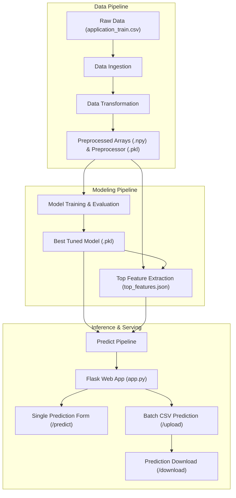

# 💳 Home Credit Default Risk Prediction - End-to-End ML System

[](https://www.python.org/)
[](https://flask.palletsprojects.com/)
[](https://scikit-learn.org/)
[](LICENSE)

An end-to-end Machine Learning system and production-ready Flask web application designed to assess loan default risk for credit applicants. The solution addresses the **Home Credit Default Risk** challenge by predicting applicant creditworthiness through automated data ingestion, transformation pipelines, machine learning model evaluation, and intuitive web interfaces for both single-applicant evaluation and high-throughput batch CSV processing.

---

## 📌 Table of Contents

- [Business Problem](#-business-problem)
- [Key Features](#-key-features)
- [Project Architecture](#-project-architecture)
- [Machine Learning Workflow](#-machine-learning-workflow)
- [Directory Structure](#-directory-structure)
- [Installation and Setup](#-installation-and-setup)
- [Running the Pipelines](#-running-the-pipelines)
- [Running the Web Application](#-running-the-web-application)
- [Testing Suite](#-testing-suite)
- [Technologies Used](#-technologies-used)

---

## 💼 Business Problem

Many individuals struggle to get loans due to insufficient or non-existent credit histories. Home Credit strives to broaden financial inclusion for the unbanked population by providing a safe lending experience. 

This project leverages historical application and behavioral data to predict whether a loan applicant will have repayment difficulties (`TARGET = 1`) or successfully repay their loan (`TARGET = 0`). By identifying default risk accurately, lenders can approve viable borrowers safely while mitigating default losses.

---

## ✨ Key Features

- **Modular ML Pipeline Architecture**: Built with distinct components for Data Ingestion, Data Transformation, and Model Training following production best practices.
- **Robust Feature Preprocessing**:
  - Imputation of missing numerical data using median strategies and `RobustScaler` scaling.
  - Imputation of categorical variables with frequent strategies and `OneHotEncoder` encoding.
  - Automatic extraction and tracking of feature metadata and top predictive indicators.
- **Multi-Model Evaluation & Hyperparameter Tuning**:
  - Compares Random Forest, XGBoost, and Gradient Boosting algorithms.
  - Automated hyperparameter fine-tuning via `GridSearchCV` driven by [config/model.yaml](config/model.yaml).
- **Interactive Flask Web Application**:
  - **Single Prediction**: Form-based applicant scoring using top model indicators with sample-data autofill.
  - **Batch CSV Upload**: High-throughput file processing with real-time class summaries (`good` vs `bad`) and live data previews.
  - **Export Results**: Instant download of classified predictions in CSV format.
- **Custom Exception & Logging Framework**: Centralized logging system writing execution logs to `logs/` alongside custom traceback error details.

---

## 🏗️ Project Architecture



---

## 📂 Directory Structure

```plaintext
Home_Credit_Project/
├── .gitignore                      # Git ignore file (excludes virtualenv, cache, large datasets)
├── README.md                       # Project documentation
├── app.py                          # Flask web application entrypoint
├── requirements.txt                # Project dependencies
├── config/
│   └── model.yaml                  # Model hyperparameter tuning configuration
├── data/
│   └── .gitkeep                    # Raw dataset directory placeholder
├── artifacts/
│   ├── .gitkeep                    # Artifacts directory placeholder
│   ├── model.pkl                   # Trained model object
│   ├── preprocessor.pkl            # Fitted preprocessing pipeline
│   ├── top_features.json           # Top predictive feature names & baseline means
│   ├── predictions/                # Output directory for batch predictions
│   └── uploads/                    # Temporary uploaded batch files
├── logs/
│   └── .gitkeep                    # Application and pipeline runtime logs
├── notebooks/
│   └── home_credit.ipynb           # Exploratory data analysis & model prototyping
├── src/
│   ├── __init__.py
│   ├── exception.py                # Custom exception handling with line-level traceback
│   ├── logger.py                   # Centralized logging setup
│   ├── components/
│   │   ├── __init__.py
│   │   ├── data_ingestion.py       # Reads raw data and places in artifacts
│   │   ├── data_transformation.py  # Cleans, imputes, scales, and encodes features
│   │   └── model_trainer.py        # Evaluates models and executes GridSearchCV
│   ├── constant/
│   │   └── __init__.py             # Project-wide constants and default file paths
│   ├── pipeline/
│   │   ├── __init__.py
│   │   ├── train_pipeline.py       # Orchestrates full end-to-end training cycle
│   │   └── predict_pipeline.py     # Inference logic for single and batch predictions
│   └── utils/
│       ├── __init__.py
│       ├── main_utils.py           # I/O helpers (pickle, yaml, file handling)
│       └── extract_top_features.py # Computes top feature importances and means
├── templates/
│   ├── form.html                   # Single applicant web prediction UI (Bootstrap 5)
│   └── upload.html                 # Batch CSV upload and results preview UI
└── tests/
    ├── test_data_ingestion.py      # Data ingestion component test
    ├── test_data_transformation.py # Data transformation pipeline test
    ├── test_model_trainer.py       # Model training component test
    ├── test_extract_top_features.py# Top features extraction utility test
    ├── test_train_pipeline.py      # End-to-end training pipeline test
    └── test_predict_pipeline.py    # Batch prediction pipeline test
```

---

## ⚙️ Installation and Setup

### 1. Clone the Repository
```bash
git clone https://github.com/<your-username>/Home_Credit_Project.git
cd Home_Credit_Project
```

### 2. Create and Activate Virtual Environment
**On Windows (PowerShell):**
```powershell
python -m venv myenv
.\myenv\Scripts\activate
```

**On Linux / macOS:**
```bash
python3 -m venv myenv
source myenv/bin/activate
```

### 3. Install Dependencies
```bash
pip install -r requirements.txt
```

---

## 🚀 Running the Pipelines

### Full End-to-End Training Pipeline
To run the automated ingestion, transformation, model evaluation/tuning, and feature extraction:
```bash
python src/pipeline/train_pipeline.py
```
Or run the dedicated test runner:
```bash
python tests/test_train_pipeline.py
```

### Batch Prediction Test
To verify inference against test datasets:
```bash
python tests/test_predict_pipeline.py
```

---

## 🌐 Running the Web Application

Launch the Flask application:
```bash
python app.py
```

Once running, navigate to:
```
http://localhost:5000
```

### Web Application Endpoints:
| Route | Method | Description |
|---|---|---|
| `/` or `/predict` | `GET`, `POST` | Single applicant risk scoring form with instant classification |
| `/upload` | `GET`, `POST` | Batch CSV upload interface with progress summary and table preview |
| `/download` | `GET` | Export processed batch prediction results as a `.csv` file |
| `/train` | `POST` | Trigger pipeline retraining directly from the web interface |

---

## 🧪 Testing Suite

Individual components can be verified independently using the test scripts under the `tests/` directory:

```bash
# Test Data Ingestion
python tests/test_data_ingestion.py

# Test Data Transformation
python tests/test_data_transformation.py

# Test Model Trainer
python tests/test_model_trainer.py

# Test Top Feature Extraction
python tests/test_extract_top_features.py

# Test Prediction Pipeline
python tests/test_predict_pipeline.py

# Test Full Training Pipeline
python tests/test_train_pipeline.py
```

---

## 🛠️ Technologies Used

- **Language**: Python 3.12+
- **Machine Learning**: Scikit-Learn, XGBoost, NumPy, Pandas
- **Web Framework**: Flask, Jinja2, Werkzeug
- **Front-End Styling**: Bootstrap 5, Bootstrap Icons
- **Configuration & Utilities**: PyYAML, Pickle
- **Development & Version Control**: Git, GitHub

---

## 📄 License

This project is licensed under the MIT License - feel free to use and adapt it for learning or production purposes.
