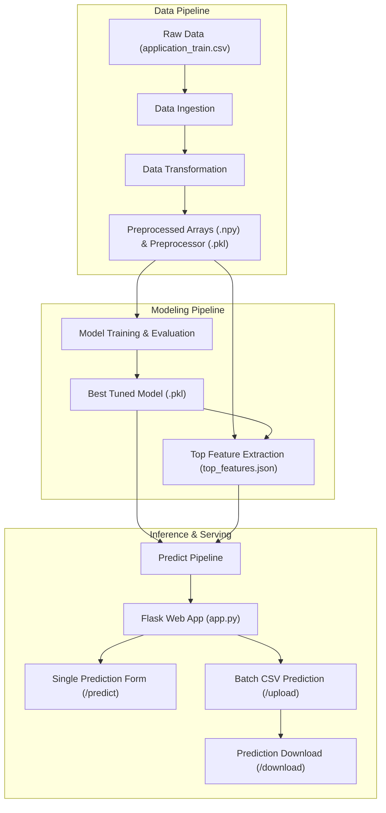

# 💳 Home Credit Default Risk Prediction - End-to-End ML System

An end-to-end Machine Learning system and production-ready Flask web application designed to assess loan default risk for credit applicants. The solution addresses the **Home Credit Default Risk** challenge by predicting applicant creditworthiness through automated data ingestion, transformation pipelines, machine learning model evaluation, and intuitive web interfaces for both single-applicant evaluation and high-throughput batch CSV processing.

---

## 📌 Table of Contents

- [Business Problem](#-business-problem)
- [Key Features](#-key-features)
- [Project Architecture](#-project-architecture)
- [Machine Learning Workflow](#-machine-learning-workflow)
- [Directory Structure](#-directory-structure)
- [Installation and Setup](#-installation-and-setup)
- [Running the Pipelines](#-running-the-pipelines)
- [Running the Web Application](#-running-the-web-application)
- [Testing Suite](#-testing-suite)
- [Technologies Used](#-technologies-used)

---

## 💼 Business Problem

Many individuals struggle to get loans due to insufficient or non-existent credit histories. Home Credit strives to broaden financial inclusion for the unbanked population by providing a safe lending experience.

This project leverages historical application and behavioral data to predict whether a loan applicant will have repayment difficulties (`TARGET = 1`) or successfully repay their loan (`TARGET = 0`). By identifying default risk accurately, lenders can approve viable borrowers safely while mitigating default losses.

---

## ✨ Key Features

- **Modular ML Pipeline Architecture**: Built with distinct components for Data Ingestion, Data Transformation, and Model Training following production best practices.
- **Robust Feature Preprocessing**:
  - Imputation of missing numerical data using median strategies and `RobustScaler` scaling.
  - Imputation of categorical variables with frequent strategies and `OneHotEncoder` encoding.
  - Automatic extraction and tracking of feature metadata and top predictive indicators.
- **Multi-Model Evaluation & Hyperparameter Tuning**:
  - Compares Random Forest, XGBoost, and Gradient Boosting algorithms.
  - Automated hyperparameter fine-tuning via `GridSearchCV` driven by [config/model.yaml](config/model.yaml).
- **Interactive Flask Web Application**:
  - **Single Prediction**: Form-based applicant scoring using top model indicators with sample-data autofill.
  - **Batch CSV Upload**: High-throughput file processing with real-time class summaries (`good` vs `bad`) and live data previews.
  - **Export Results**: Instant download of classified predictions in CSV format.
- **Custom Exception & Logging Framework**: Centralized logging system writing execution logs to `logs/` alongside custom traceback error details.

---

## 🏗️ Project Architecture

---
